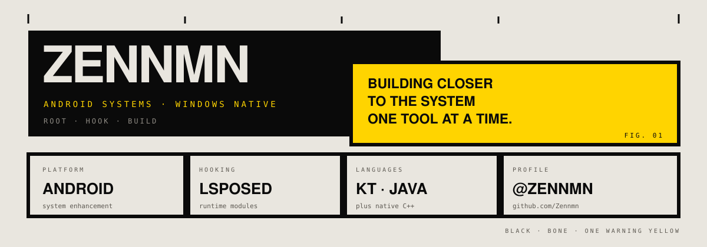
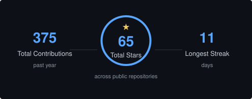

  

## WHAT I BUILD

专注于 Android 系统增强、Root 工具与 Windows 原生应用。喜欢贴近系统工作：观察、Hook、修改，然后把复杂能力做成真正可用的工具。

## SELECTED WORK

- **[AM-plus-plus](https://github.com/Zennmn/AM-plus-plus)** — Apple Music 增强模块 · `Kotlin`
- **[RTXHDR-RTXVSR](https://github.com/Zennmn/RTXHDR-RTXVSR)** — 基于 NVIDIA RTX Video 的本地视频增强工具 · `C++`
- **[HideDevOptions](https://github.com/Zennmn/HideDevOptions)** — 隐藏开发者选项及 ADB 状态的 LSPosed 模块 · `Java`
- **[HeartbeatTicker](https://github.com/Zennmn/HeartbeatTicker)** — 定时触发 GMS 心跳的轻量 Android 工具 · `Kotlin`

## GITHUB ACTIVITY

  

---

`ROOT` · `HOOK` · `BUILD` — Building useful tools, one commit at a time.
